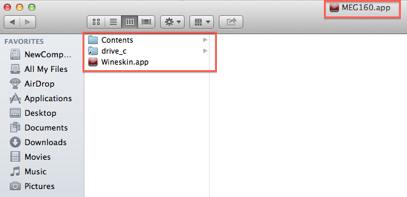

# Running MEG160 on MAC OS X.

## Option 1: Use [Parallels][parallels].

### Pros:

* It certainly works. All you need to do is copy the *MEG160* folder to your _C:\\_ drive, and double-click _offlineMEG160.exe_, in the _MEG160/Bin_ folder.

### Cons:

* It costs money. A single [Parallels][Parallels] license will cost you around 80 dollars, although they offer discounted prices for bundles of two licenses.
* It requires a Windows installation CD. If you don't have one, you might have to buy one.
* It loads a full copy of Windows in order to run, and this might unnecessarily use up a lot of resources.

[parallels]: http://www.parallels.com/

## Option 2: Use [Wine][wine].

### Pros:

* It works well, especially if you use [Wineskin][wineskin].
* It's free!
* You don't need a Windows installation disk.
* Since it does not need to load a full copy of Windows, it probably runs faster.

### Cons:

* None that I could find so far.

### How to easily install [Wine][wine] for running MEG160:

1. Go to [Wineskin][wineskin], and download the latest version of the _Wineskin Winery.app_, unzip the downloaded file and move it to your Applications folder.

    

2. Run [Wineskin][wineskin]. The _Installed Engines_ window will list the versions of [Wine][wine] you might have installed. If you have none, you can do a clean install by clicking on the "+" button at the bottom of the window.

3. Select the latest [Wine][wine] engine version and click install.

![Select the latest [Wine][wine] engine.](./images/list_of_wine_engines.png)

![Downloading the latest [Wine][wine] engine.](./images/download_wine_engine.png)

4. Look at the _Wrapper Version_ option on the Wineskin Winery main screen (under the _Installed Engines_ box). If it is empty, click on _Update_.

5. Once you have the latest [Wine][wine] engine installed, you can click on the _Create New Blank Wrapper_.

6. Name the new wrapper _MEG160.app_.

7. Go to your LOCAL Applications folder (i.e., _your\_username/Applications_), find the _Wineskin_ folder, and see that _MEG160.app_ has been created within.

8. Control-click on _MEG160.app_, and select _Show Package Contents_. You should see a window with three items: two folders (_Contents_ and _drive\_c_), and _Wineskin.app_.

9. Copy the folder containing MEG160 to the _drive\_c_ folder (see figure).

10. Click on the _Wineskin.app_, back on the _MEG160.app_ folder (see previous figure). This will open the configuration dialog box.

11. Click on _Advanced_.

12. On the _Windows EXE_ menu, browse to the MEG160/Bin folder in _drive\_c_ to find _offlineMEG160.exe_, and select it.

13. Click on Test Run (see previous figure). This should open MEG160.

14. If the test run worked, you can close the window and go back to your LOCAL Applications folder, find the "Wineskin" folder, and double-click on the _MEG160.app_ within it. This should open MEG160.

15. Finally, copy the _MEG160.app_ to your Applications folder. Now you have a MEG160 working like a regular Mac app.

[wine]: http://wiki.winehq.org/MacOSX
[wineskin]: http://wineskin.urgesoftware.com/tiki-index.php
